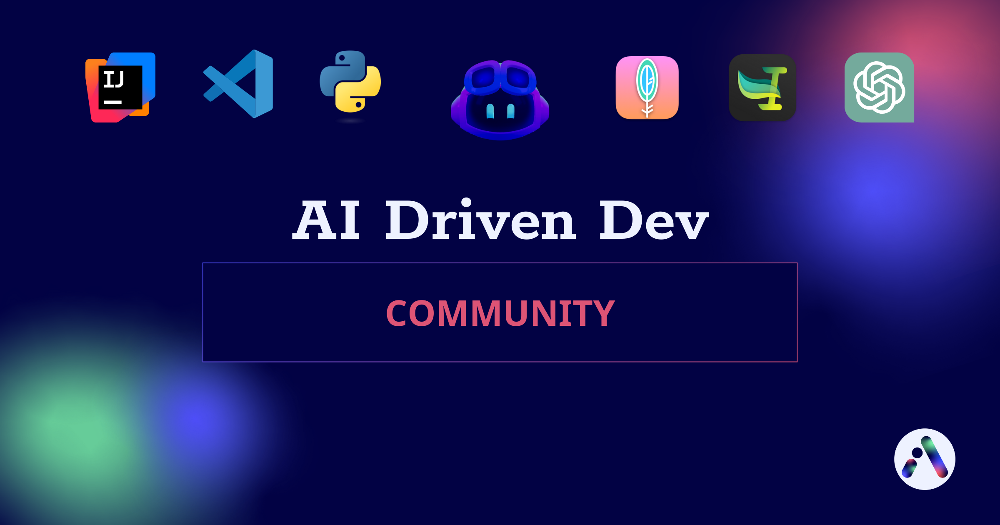
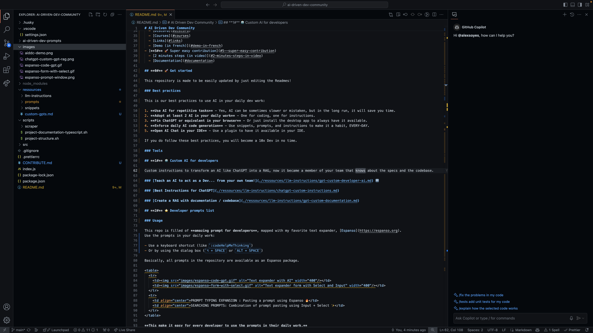
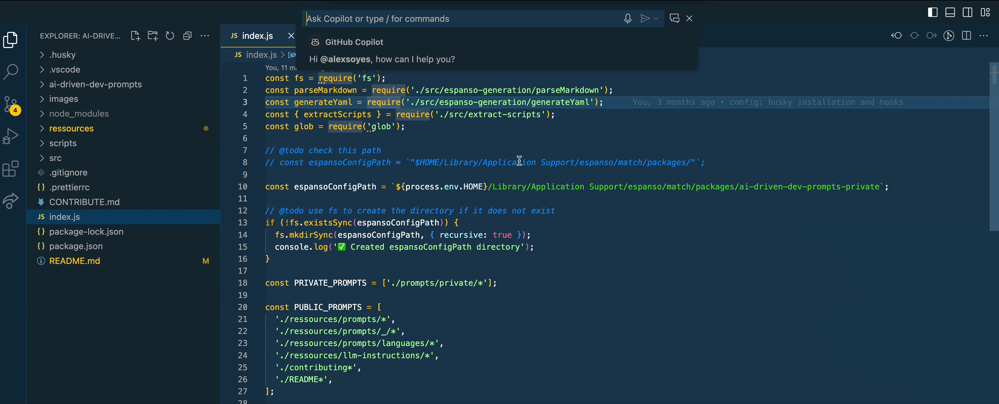
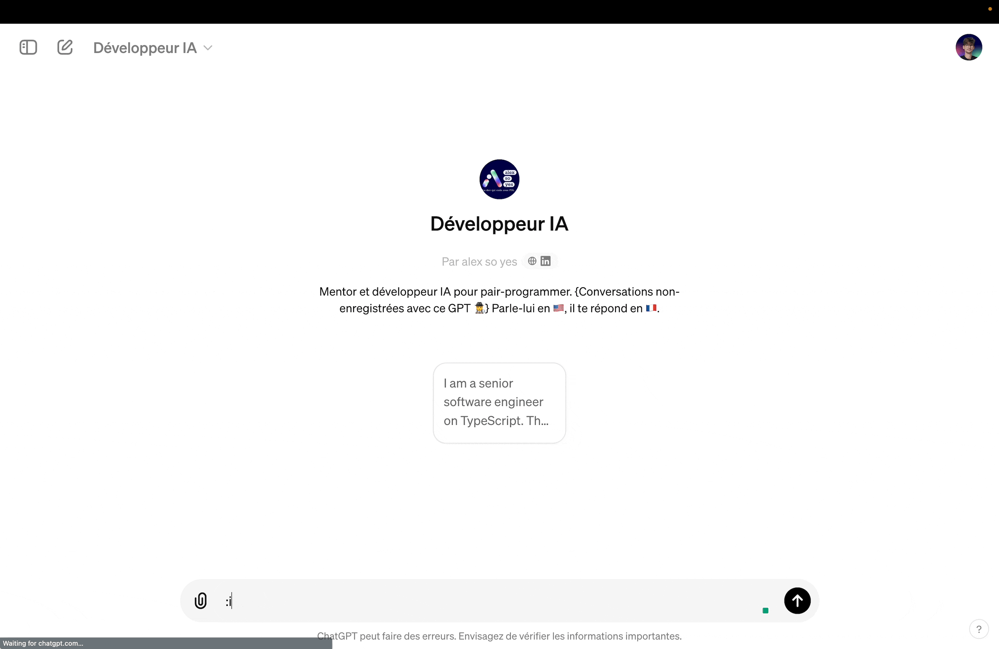
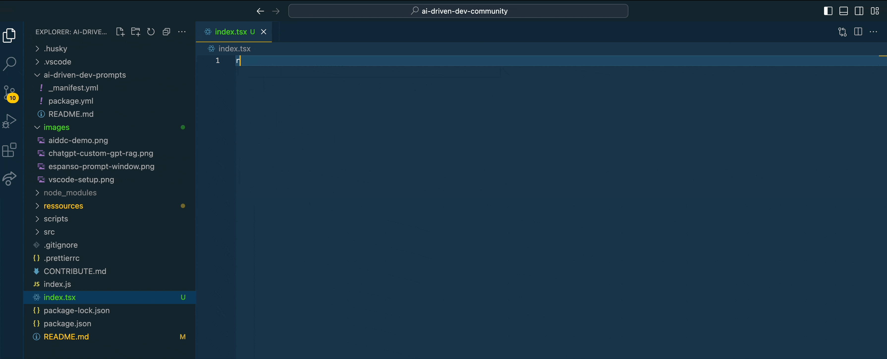
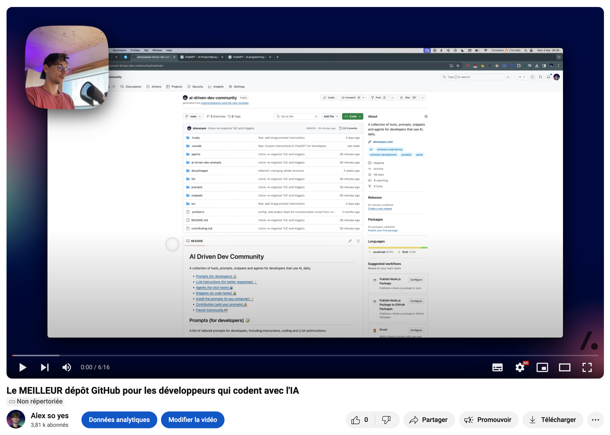

# AI Driven Dev Community



Our goal is to help you become a 10x developer by coding with AI.

The GitHub Repository is updated weekly!

**A collection of tools, prompts, snippets and agents for developers that use AI, daily.**

🇫🇷 More French resources are available to learn how to use AI in your daily work.

[](https://learn.alexsoyes.com/ressources-ia?utm_source=github&utm_medium=cta-button&utm_campaign=free-ai-resources&utm_terms=ia) [](https://discord.gg/BUcTKVfbGh)

<hr />

Get started easily with the **AI Driven Dev Community**:

- [**0#** 🚀 Get started](#0--get-started)
  - [Best practices](#best-practices)
  - [Tools to install](#tools-to-install)
  - [Example workflow of an AI Driven Dev](#example-workflow-of-an-ai-driven-dev)
- [**1#** 🤖 Custom AI for developers](#1--custom-ai-for-developers)
  - [RAG Developer](#rag-developer)
  - [Best Instructions](#best-instructions)
  - [Custom GPT Agents](#custom-gpt-agents)
- [**2#** ⭐️ Developer prompts list](#2-️-developer-prompts-list)
  - [Usage](#usage)
  - [Installation](#installation)
  - [Prompts for developers (in IDE)](#prompts-for-developers-in-ide)
  - [Prompts for developers (in Chat)](#prompts-for-developers-in-chat)
  - [Coding with AI CLI](#coding-with-ai-cli)
- [**3#** 🛠️ Install AI Toolbox for software engineers](#3-️-install-ai-toolbox-for-software-engineers)
  - [AIDDC Scripts](#aiddc-scripts)
  - [Website scraper](#website-scraper)
  - [Private prompts](#private-prompts)
  - [VSCode snippets](#vscode-snippets)
- [**4#** ❤️ Get support](#4-️-get-support)
  - [Discord](#discord)
  - [✨ Courses (in french)](#-courses-in-french)
  - [Links](#links)
  - [AIDDC Video Demo (in french)](#aiddc-video-demo-in-french)
- [**5#** 🚀 Super easy contribution](#5--super-easy-contribution)
  - [5 steps to contribute in 2 minutes](#5-steps-to-contribute-in-2-minutes)
  - [No  -fork contributions](#no---fork-contributions)

## **0#** 🚀 Get started

This repository is made to be easily updated by just editing the Readmes!

### Best practices

This is our best practices to use AI in your daily dev work:

1. **Use AI for repetitive tasks** - Yes, AI can be sometimes slower or mistaken, but in the long run, it will save you time.
2. **Adopt at least 2 AI in your daily work** - One for coding, one for instructions.
3. **Pin ChatGPT or equivalent in your browser** - Or just install the desktop app to always have it available.
4. **Enforce daily AI code generation** - Use snippets, prompts, and instructions to make it a habit, EVERY-DAY.
5. **Open AI Chat in your IDE** - Use a plugin to have it available in your IDE.
6. **Check all the prompts available** - Use them, change them, embrase them the more you can.

If you do follow these best practices, you will become a 10x Dev in no time.



### Tools to install

- [Espanso](https://espanso.org) - Text expander to use the prompts in your daily work. (Required * for the prompts)
- [ChatGPT](https://chat.openai.com) - AI to help you in your daily work. (Recommended)
- [GitHub Copilot](https://copilot.github.com) - AI to help you code faster. (Recommended)
- [Maccy](https://maccy.app) - OSX Clipboard manager to use the prompts easily. (Recommended)
- [VSCode](https://code.visualstudio.com) - Because Copilot AI features are available sooner in this IDE. (Recommended)

Free and Paid alternatives are available for each tool.

[](https://alexsoyes.notion.site/c858af13ed704d7184456a3f8ac21f07?v=79a8d07b1e414ced99fcd210970b2ee8)

### Example workflow of an AI Driven Dev

Here is a basic workflow of how you can combine prompts, parameters and AI instructions.


## **1#** 🤖 Custom AI for developers

Custom instructions to transform an AI like ChatGPT into a RAG, now it became a member of your team that knows about the specs and the codebase.

### RAG Developer

Teach an AI to act as a Dev... from your own team

"Fine-tune" the LLM using a RAG to act as a developer in your project.

**This will help you to get the best out of the AI by providing it with the right context and knowledge about your project.**

1. **Documents list to provide** - Upload the relevant documents to instruct the AI about your project.
2. **Create a RAG for your project** - Instructions for AI to act as a developer **from your team**, using your language etc.

[Full page resource](./resources/llm-instructions/gpt-rag-developer.md) 🔗

### Best Instructions

Personalize the AI to have better performance and quicker answers.

**This will help you to get the best out of the AI by providing it with the right context and knowledge about your project.**

[Full page resource](./resources/llm-instructions/chatgpt-custom-instructions.md) 🔗

### Custom GPT Agents

Use those GPT agents to help you in your daily work.

(Include instructions sources)

- [Senior Dev](./resources/llm-instructions/gpt-senior-developer.md)
- [Agile Coach](./resources/llm-instructions/gpt-agile-coach.md)

## **2#** ⭐️ Developer prompts list

### Usage

This repo is filled of **amazing prompt for developers**, mapped with my favorite text expander, [Espanso](https://espanso.org).
Use the prompts in your daily work:

- Use a keyboard shortcut (like `:codeHelpMeThinking`)
- Or by using the dialog box (`⌥ + SPACE` or `ALT + SPACE`)

Basically, all prompts in the repository are available as an Espanso package.

**This make it easy for every developer to use the prompts in their daily work.**

### Installation

Guide:

1. Follow the [Espanso installation guide here](https://espanso.org/install/) for your operating system.

2. Then, install the package:

  ```sh
  espanso install ai-driven-dev-prompts --git git@github.com:alexsoyes/ai-driven-dev-community.git --external
  ```

3. Configure the package from [config directory](https://espanso.org/docs/configuration/basics/#structure):

From "`espanso path config`/default.yml":

  ```yml
  # prevent "v" being pasted instead of the prompt
  backend: "inject"
  # allow to keep current prompt in clipboard
  preserve_clipboard: false
  # reload when config / package changes
  auto_restart: true
  # delay to paste the prompt
  clipboard_threshold: 100
  ```

🔄 **Note**: Update every time you want to get the latest prompts:

  ```sh
  espanso package update ai-driven-dev-prompts
  ```

### Prompts for developers (in IDE)

Here are the best prompts to use in your IDE... Sorted!



**Those prompts have been selected AND tested to help you in your daily work.**

Feel free to use them and add your own! ❤️ (credit your own prompts)

- 🐛 [Bug Fixing](./resources/prompts/bug-fixing.md) (*in progress*)
- 🕵️‍♀️ [Code Review](./resources/prompts/code-review.md) (*in progress*)
- 💻 [Code Writing](./resources/prompts/code-writing.md)
- 📚 [Documentation](./resources/prompts/documentation.md)
- 🛠️ [General Dev](./resources/prompts/dev.md) - Help to use AI in our daily work (but not specifically AI oriented).
- ♻️ [Refactoring](./resources/prompts/refactoring.md) (*in progress*)
- 🧪 [Testing](./resources/prompts/testing.md)

More dev prompts:

- Language Specific
  - [TypeScript](./resources/prompts/languages/typescript.md)
- Private prompts
  - [Your private (or team) prompts](./resources/prompts/private)

### Prompts for developers (in Chat)

Sometimes you need a bigger context to get the best out of your AI.



Use those dev prompts (mostly in ChatGPT or equivalent):

- 🗃️ [Database](./resources/prompts/database.md)
- 🖼️ [Image to Code](./resources/prompts/image-to-code.md)
- 🚀 [Feature Request](./resources/prompts/feature-request.md)
- 📋 [Project Management](./resources/prompts/project-management.md)
- 🚧 [Project Setup](./resources/prompts/project-setup.md)

### Coding with AI CLI

Use the CLI to code with the AI when you need to write in multiple files at once.

- 💾 [Guide - Coding with AI CLI (+ example script)](./resources/guide/coding-with-cli.md)


## **3#** 🛠️ Install AI Toolbox for software engineers

Clone this repo: `git clone git@github.com:alexsoyes/ai-driven-dev-community.git`

You are all set!

Requirements:

- [Node.js](https://nodejs.org/en/download/) - To run the project.

### AIDDC Scripts

A set of scripts for developers that directly communicate with OpenAI's ChatGPT API.

Full documentation available in the [scripts directory](./scripts/aiddc/README.md).

Available aliases:

- `aiddc-changes` : List the changes in the repository.
- `aiddc-changes-from-main` : List the changes in the repository from the main branch.
- `aiddc-commit-last` : Get the last commit message.
- `aiddc-commit-msg` : Generate a commit message (using AI).

```bash
curl -sSf https://raw.githubusercontent.com/alexsoyes/ai-driven-dev-community/main/scripts/aiddc/install.sh | bash
```

### Website scraper

A python scraper to save HTML / Markdown content from your best websites.

Full documentation available in the [scraper directory](./scripts/scraper/README.md).

Requirements:

- [Python 3+](https://www.python.org/downloads/) - To run the scraper.

### Private prompts

Having your personal prompts in a huge Notion doc or shared with your team?

**You can easily make them available privately in your computer with Espanso.**

1. Add your prompts in `markdown`in the directory `./prompts/private/`
2. Take a look at the [contributing guide](./CONTRIBUTE.md) to create a perfect prompt.
3. Start the project: `npm i && npm start`

Enjoy your private prompts!

### VSCode snippets

We created a list of snippets we daily use as a frontend TypeScript developer.



AI makes way much easier code generation.

> But sometimes, when you exactly know what you need, you do not necessary need a Gen-AI to write obvious code for you.

Thus, AI can be mistaken, as a developer, you are the master of your code structure.

Feel free to use them!

**Languages**:

- [TypeScript](./resources/snippets/vscode/typescript.json)

**Libraries**:

- [React](./resources/snippets/vscode/typescriptreact.json)

**Installation**:

You can install them easily with the following script:

```bash
#!/bin/bash

# TODO: add OS support
# TODO: merge with existing files

PATH_SOURCE=$(pwd)/vscode
PATH_DESTINATION=~/Library/Application\ Support/Code/User/snippets

# Check if both source and destination exist
if [ ! -d "${PATH_SOURCE}" ]; then
  echo "Source directory does not exist: ${PATH_SOURCE}"
  exit 1
fi

if [ ! -d "${PATH_DESTINATION}" ]; then
  echo "Destination directory does not exist: ${PATH_DESTINATION}"
  exit 1
fi

# For each file in source, copy it in the destination, but if exists, rename it with a .bak extension and current date
for file in $(ls "${PATH_SOURCE}"); do
  filename=$(basename $file)
  if [ -f "${PATH_DESTINATION}/$filename" ]; then
    mv "${PATH_DESTINATION}/$filename" "${PATH_DESTINATION}/$filename.bak.$(date +%Y%m%d)"
  fi

  cp -v "${PATH_SOURCE}/${filename}" "${PATH_DESTINATION}/${filename}"
done

# source: scripts/generated/snippets-install-osx.sh
```

## **4#** ❤️ Get support

We are a group of french software engineers that are using AI in our daily work.

### Discord

Motivated to use AI in your daily developer work life?

Join us on Discord to get the **latest updates, news and shared experiences** with AI.

[](https://discord.gg/BUcTKVfbGh)

### ✨ Courses (in french)

French courses are available to learn how to use AI in your daily work.

[](https://learn.alexsoyes.com/formation-coder-avec-ia?utm_source=github&utm_medium=cta-button&utm_campaign=formation-coder-avec-ia&utm_terms=ia)

### Links

Various links available that do not fit in other categories:

**External**:

- [Anthropic Prompt Library](https://docs.anthropic.com/en/prompt-library/website-wizard) - A collection of prompts to use with Claude.
- [LLMLingua](https://llmlingua.com) - Prompts compressing for accelerated inference.
- [GitHub: "Awesome Agents"](https://github.com/kyrolabs/awesome-agents) - A curated list of AI agents to use in your daily work.
- [GitHub: Copilot course from Microsoft](https://github.com/microsoft/Mastering-GitHub-Copilot-for-Paired-Programming) - Mastering GitHub Copilot for Paired Programming.

**Internal**:

- [GPTs source list for developers 📋](./resources/custom-gpts.md) (Include prompt source when available)
- [Various](./resources/prompts/_/various.md) - Various and personals prompts that do not fit in other categories.

[](https://alexsoyes.notion.site/c858af13ed704d7184456a3f8ac21f07?v=79a8d07b1e414ced99fcd210970b2ee8)

### AIDDC Video Demo (in french)

Check the [Demo on YouTube](http://www.youtube.com/watch?v=1YvECxOn2_Q) to learn how to use our repository!

[](http://www.youtube.com/watch?v=1YvECxOn2_Q)

## **5#** 🚀 Super easy contribution

This repository is made to be easily updated by just editing the Readmes!

It will automatically update the prompts and the scripts.

**If only one person updates one Readme, the whole community will benefit from it.**

### 5 steps to contribute in 2 minutes

1. [Fork the repository](https://github.com/alexsoyes/ai-driven-dev-community/fork), then clone it.
2. After installation, run `npm i && npx husky-init` if you want to **automatically**:
3. Update any Readme from sub-directories in `./resources` to automatically generate the prompts in Espanso and scripts generation!
4. Check the [Contributing guide](./CONTRIBUTE.md)
5. Push your changes and create a Pull Request.

### No  -fork contributions

You can also contribute without forking the repository:

Report prompting issues / improvements at [hello@alexsoyes.com](mailto:hello@alexsoyes.com)
