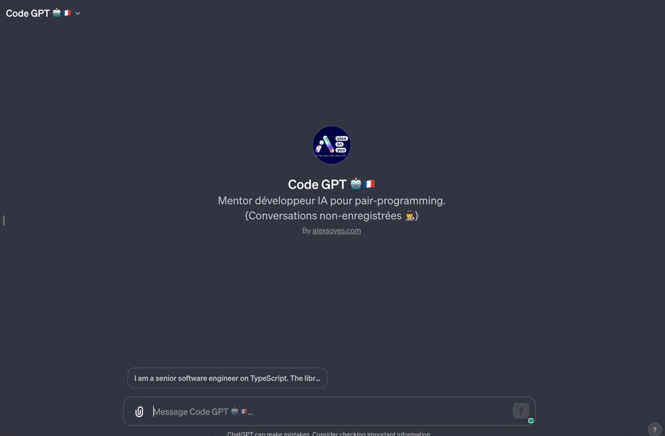
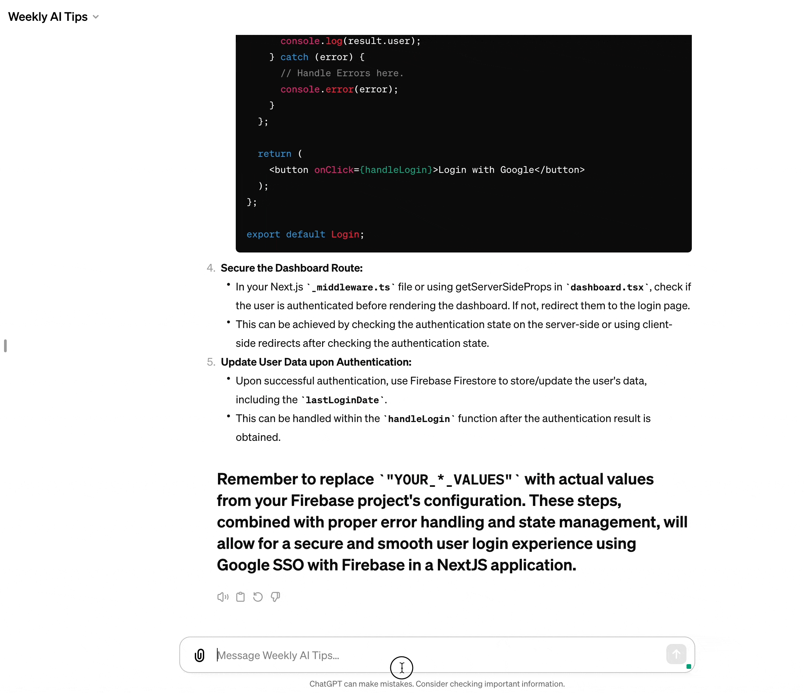

# AI Driven Dev Community

**A collection of tools, prompts, snippets and agents for developers that use AI, daily.**

- [📝 Prompts list](#-prompts-list)
- [🧠 Custom AI](#-custom-ai)
- [🧑‍💻 Snippets](#-snippets)
- [⚡️ Custom GPTs list for coders](#️-custom-gpts-list-for-coders)
- [💻 Install prompts locally](#-install-prompts-locally)
- [👀 Use your private customs prompts](#-use-your-private-customs-prompts)
- [📇 New prompts](#-new-prompts)
- [🇫🇷 Demo](#-demo)

## 📝 Prompts list

A list of tailored prompts for developers, including instructions, coding and LLM optimizations.

- [Coding](./ressources/prompts/code.md) - Specific short coding prompts.
- [Instructions](./ressources/prompts/instruct.md) - Long prompt to automate coding features. 🆕

And more:

- [Dev](./ressources/prompts/dev.md) - Help to use AI in our daily work (but not specifically AI oriented).
- [Various](./ressources/prompts/_/various.md) - Various and personals prompts that do not fit in other categories.

## 🧠 Custom AI

Custom instructions to transform an AI like ChatGPT into a RAG, now it became a member of your team that knows about the specs and the codebase.

- [Instruct an AI as a developer from your Team!](./ressources/llm-instructions/gpt-custom-developer-ai.md) 🆕
- [Custom Instructions in ChatGPT for Developers](./ressources/llm-instructions/chatgpt-custom-instructions.md)

## 🧑‍💻 Snippets

AI makes way much easier code generation.

> But sometimes, when you exactly know what you need, you do not necessary need a Gen-AI to write obvious code for you.

Thus, AI can be mistaken, as a developer, you are the master of your code structure.

- [VSCode Snippets](./ressources/snippets/vscode/)
  - [TypeScript](./ressources/snippets/vscode/typescript.json)
  - [React](./ressources/snippets/vscode/typescriptreact.json)

Note :

JetBrains Snippets are not available for now, wanna add yours? [See how!](./contributing.md))

## ⚡️ Custom GPTs list for coders

Fine-tuned GPTs for developers help you to get the best out of your AI.

- [GPTs source list for developers 📋](./ressources/gpt.md) (Include prompt source when available)

## 💻 Install prompts locally

This repo is filled of **amazing prompt for developers**, mapped with my favorite text expander, [Espanso](https://espanso.org).

Basically, all prompts in the repository are available as an Espanso package.

<table>
  <tr>
    <td></td>
    <td></td>
  </tr>
  <tr>
    <td align="center">PROMPT TYPING EXPANSION : Pasting a prompt using Espanso 🔥</td>
    <td align="center">SEARCHING PROMPTS: Combination of prompt pasting using Input + Select ✨</td>
  </tr>
</table>

**This make it easy for every developer to use the prompts in their daily work.**

Guide:

1. Follow the [Espanso installation guide here](https://espanso.org/install/) for your operating system.

2. Then, install the package:

  ```shell
  espanso install ai-driven-dev-prompts --git git@github.com:alexsoyes/ai-driven-dev-community.git --external
  ```

3. Last, update every time you want to get the latest prompts:

  ```shell
  espanso package update ai-driven-dev-prompts
  espanso package update all # or if you want to update all your packages at once :)
  ```

4. Use the prompts in your daily work:

   - Use a keyboard shortcut (like `:codeHelpMeThinking`)
   - Or by using the dialog box (`⌥ + SPACE` or `ALT + SPACE`)

## 👀 Use your private customs prompts

You have your personal prompts in a huge Notion doc?

**You can easily make them available privately in your computer with Espanso.**

1. Clone this repo: `git clone git@github.com:alexsoyes/ai-driven-dev-community.git`
2. Add your prompts in `markdown`in the directory `ai-driven-dev-community/prompts/private/`
3. Take a look at the [guide](./contributing.md) to create the good templates
4. Run the project (Node.js needed): `npm i && npm start`
5. Reload your Espanso
6. Enjoy your private prompts!

## 📇 New prompts

This list is community based, feel free to improve it or add yours!

❤️ **2 minutes contribution guide:**

1. [Fork the repository](https://github.com/alexsoyes/ai-driven-dev-community/fork), then clone it.
2. After project installation, run `npx husky-init` if you want to **automatically**:
   1. Generate [Espanso package](./ai-driven-dev-prompts/package.yml) and manifest (*on commit*)
3. Update any Readme from directories `` to automatically generate the prompts!
4. Here is an [example of file structure](https://github.com/alexsoyes/ai-driven-dev-community/blob/main/prompts/code.md?plain=1)
5. Report prompting issues / improvements at [hello@alexsoyes.com](mailto:hello@alexsoyes.com)

## 🇫🇷 Demo

Join a group of french software engineers that are using AI.

[](https://discord.gg/BUcTKVfbGh)

- Check the [Demo](http://www.youtube.com/watch?v=1YvECxOn2_Q)!

[](http://www.youtube.com/watch?v=1YvECxOn2_Q)
