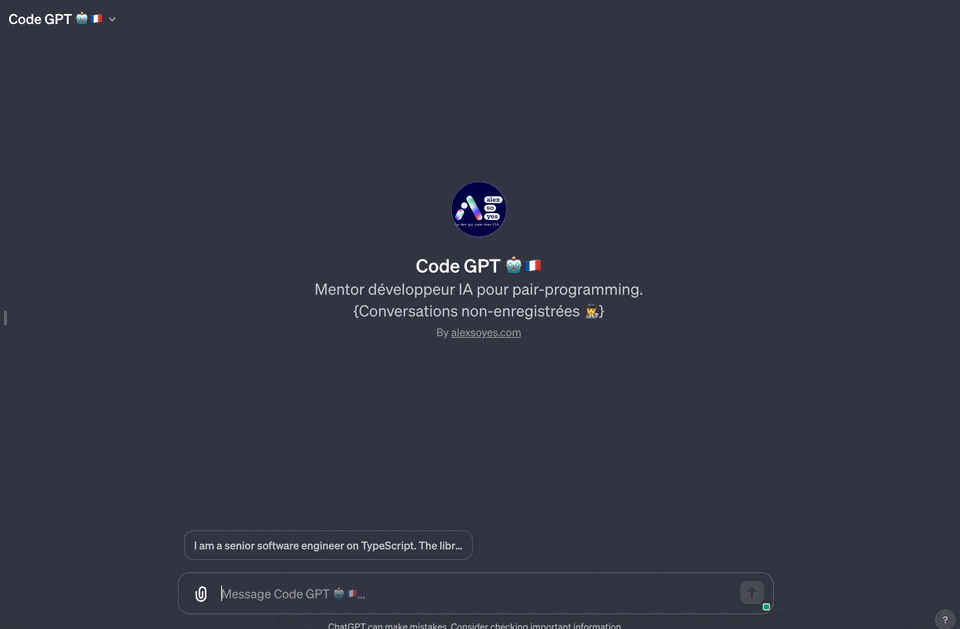

# AI Driven Dev Community

A collection of tools, prompts, snippets and agents for developers that use AI, daily.

- [Prompts (for developers) 📝](#prompts-for-developers-)
- [LLM Instructions (for better responses) 💡](#llm-instructions-for-better-responses-)
- [Agents (for tech team) 🤖](#agents-for-tech-team-)
- [Snippets (to code faster) 🧑‍💻](#snippets-to-code-faster-)
- [Install the prompts (in you computer) ⚡️](#install-the-prompts-in-you-computer-️)
- [Contribution (add your prompts) ✍️](#contribution-add-your-prompts-️)
- [French Community 🇫🇷](#french-community-)

## Prompts (for developers) 📝

A list of tailored prompts for developers, including instructions, coding and LLM optimizations.

- [Coding](./prompts/code.md)
- [Instructions](./prompts/instruct.md)
- [LLM optimizations](./prompts//llm.md)

## LLM Instructions (for better responses) 💡

Custom instructions for developers to use with ChatGPT.

- [Custom Instructions in ChatGPT for Developers](./llm/chatgpt-custom-instructions-developer.md)

## Agents (for tech team) 🤖

2 fine-tuned AIs to work with you, as a tech team members, filled with knowledge and experience about their specific role.

**If you need to ask a question, or need help, do not use ChatGPT directly, use the agents instead.**

- Custom GPT Access : [AI Project Manager (Agile Coach, PO, PM...)](https://chat.openai.com/g/g-KbmBiVnyq-agile-gpt) (*WIP*) - ([Source](./agents/agile-coach.md))
- Custom GPT Access : [AI Programming Expert](https://chat.openai.com/g/g-S1wfMarvA-ai-programming-expert) ([Source](./agents/senior-developer.md))

## Snippets (to code faster) 🧑‍💻

AI makes way much easier code generation.

But sometimes, when you exactly know what you need, you do not necessary need a Gen-AI to write obvious code for you.

Thus, AI can be mistaken, as a developer, you are the master of your code structure.

- [VSCode Snippets](./snippets/vscode/)
  - [TypeScript](./snippets/vscode/typescript.json)
  - [React](./snippets/vscode/typescriptreact.json)
- JetBrains Snippets (Not available, want to add yours? [Contribute!](./contributing.md))

## Install the prompts (in you computer) ⚡️

This repo is filled of **amazing prompt for developers**, mapped with my favorite text expander, [Espanso](https://espanso.org).


In combination with ChatGPT (or another generative AI).

Follow the [Espanso installation guide here](https://espanso.org/install/) for your operating system.

Then:

```shell
espanso install ai-driven-dev-prompts --git git@github.com:alexsoyes/ai-driven-dev-community.git --external
```

In order update:

```shell
espanso package update ai-driven-dev-prompts
espanso package update all # or if you want to update all your packages at once :)
```

Finally, just:

- Use a keyboard shortcut (like `:codeHelpMeThinking`)
- Or by using the dialog box (`⌥ + SPACE` or `ALT + SPACE`)

## Contribution (add your prompts) ✍️

Contribution are welcomed, [check the guide](./contributing.md)!

This list is community based, feel free to improve it!

❤️ **2 minutes contribution guide:**

1. [Fork the repository](https://github.com/alexsoyes/ai-driven-dev-community/fork), then clone it.
2. After project installation, run `npx husky-init` if you want to **automatically**:
   - Generate [Espanso package](./ai-driven-dev-prompts/package.yml) and manifest (*on commit*)
   - Replace VSCode snippets (*on pull*)
   - Update Espanso's prompts (*post push*)
3. Update a Readme to automatically generate the prompts!

Report prompting issues / improvements at [hello@alexsoyes.com](mailto:hello@alexsoyes.com)

## French Community 🇫🇷

Join a group of french software engineers that are using AI.

[](https://discord.gg/mcNwacZCvC)
