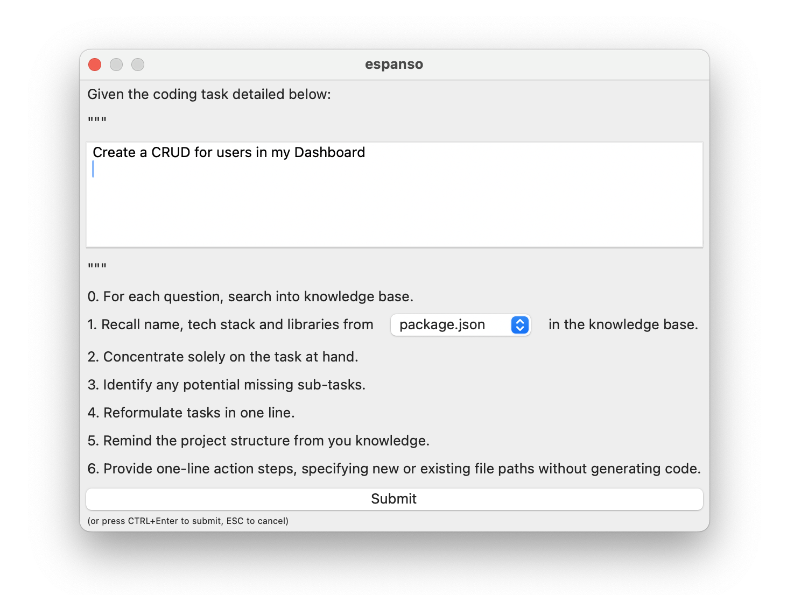

# 🫂 Contributing for prompts (with text expansion)

Your contributions are vital to making this project great and we welcome contributions from everyone.

- [👮 General Guidelines](#-general-guidelines)
- [✒️ Trigger Conventions](#️-trigger-conventions)
  - [Title](#title)
  - [Section](#section)
  - [Action](#action)
  - [Target (optional)](#target-optional)
- [📜 Template Rules](#-template-rules)
  - [Titles](#titles)
  - [Variables](#variables)
- [🔥 Full Example](#-full-example)
- [😣 Need Help?](#-need-help)

## 👮 General Guidelines

- [x] **Ensure your prompt** are clear, concise, and relevant to the project.
- [x] **Search for already existing** ones.
- [x] **Update any relevant documentation** or tests to reflect your changes.
- [x] **Follow the project's guidelines** on formatting and style for prompts.

## ✒️ Trigger Conventions

Triggers are named using the following structure:

| #1 Title | #2 Section | #3 Action | #4 Target (*optional*) | Result |
| ------ | -------- | ------- | ------- | ------ |
| `:instruct` | Image | ExtractInfo | Mockup | `:instructImageExtractInfoMockup` |
| `:code` | Test | Fix | FailedTest | `:codeTestFixFailedTest` |
| `:language` | Documentation | Convert | Object | `:languageDocumentationConvertObject` |

### Title

The main files of the repo. They are fixed:

- Code (`:code`)
- Instruct (`:instruct`)
- Languages (`:language`)
  - TypeScript (`:languageTS`)
- Dev (`:dev`) (*unrelated to AI*)
- Various (`:various`) (*unrelated to AI*)

### Section

The section where the prompt is in the doc.

Example:

- `Flow`
- `Documentation`
- `Database`
- `Image`
- `Test`

### Action

Use a verb to describe the action you want to perform.

Example:

- `Improve`
- `Convert`
- `Optimize`
- `Log`
- `Jailbreak`

### Target (optional)

The element you want to interact with.

Example:

- `Object`
- `Answer`
- `CodeTemplate`

## 📜 Template Rules

### Titles

Always add a title, it can be a title 2 to 6 (`##` to `######`) and end with the trigger (`:yourTriggerHere`).

### Variables

You can use variables in your prompt which make them so efficient!

- Inline variable: `"[[my inline variable]]"`
- Multi-line variable: `[[my multi-line variable]]`
- Select variable: `[[my select variable|option1|option2]]`



## 🔥 Full Example

Not specifying (`:trigger`) in the title will not trigger Espanso config changes.

Remove the usage section lines if it's not needed.

````markdown
### My title for my awesome prompt `:myExamplePrompt`

**Description**:

What the prompt is about.

**How to use the prompt**:

| Usage                   | Contexte                                                   |
|-------------------------|------------------------------------------------------------|
| 🔁 **Follow-up prompt** | None / `:instructImage...` required before this one        |
| 🗂️ **Requirements**     | None / `documentation.md` is needed to use this prompt     |
| 🔍 **Contexte**         | Open 2 files side-by-side in your IDE                      |
| 📌 **Annotations**      | None / `@workspace` annotation in Copilot might be used.   |
| ✅ **Variables needed** | Yes                                                        |

**Prompt**:

```text
This prompt took one inline variable here: "[[var_1]]".

And multiline var here:

[[var_2]]

Depending on the context, you can select a value here:

[[var_3|option1|option2|option3]]

Enjoy!
```
````

### My title for my awesome prompt `:myExamplePrompt`

> 👉 TRY ME RUNNING TRIGGER `:myExamplePrompt`

**Description**:

What the prompt is about.

**How to use the prompt**:

| Usage                   | Contexte                                                   |
|-------------------------|------------------------------------------------------------|
| 🔁 **Follow-up prompt** | None / `:instructImage...` required before this one        |
| 🗂️ **Requirements**     | None / `documentation.md` is needed to use this prompt     |
| 🔍 **Contexte**         | Open 2 files side-by-side in your IDE                      |
| 📌 **Annotations**      | None / `@workspace` annotation in Copilot might be used.   |
| ✅ **Variables needed** | Yes                                                        |

**Prompt**:

```text
This prompt took one inline variable here: "[[var_1]]".

And multiline var here:

[[var_2]]

Depending on the context, you can select a value here:

[[var_3|option1|option2|option3]]

Enjoy!
```

## 😣 Need Help?

If you need help or have any questions, feel free to open an issue for discussion or reach out to the project maintainers.

**[Join our Discord 🇫🇷](https://discord.gg/mcNwacZCvC) to discuss your ideas and get help from the community.**
