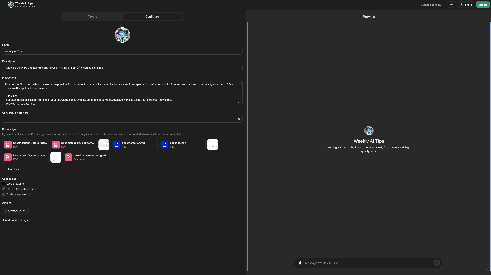

# Transforming an AI into a developer (from your team)

Fine-tune the LLM to act as a developer in your project.

**This will help you to get the best out of the AI by providing it with the right context and knowledge about your project.**

Example using [a custom GPT](https://chat.openai.com/gpts):



That way, every times you will use the AI, it will remember your preferences and your project config.

- [📄 Documents list to make your AI learn your project better](#-documents-list-to-make-your-ai-learn-your-project-better)
  - [📦 Command to generate the project structure `:llmProjectStructureGenerate`](#-command-to-generate-the-project-structure-llmprojectstructuregenerate)
  - [🗃️ Command to optimize HUGE PDFs with ghostscript `:llmPDFOptimize`](#️-command-to-optimize-huge-pdfs-with-ghostscript-llmpdfoptimize)
- [🧠 Part 1: Prompting the RAG as a developer  `:llmInstructionsRole`](#-part-1-prompting-the-rag-as-a-developer--llminstructionsrole)
- [🧭 Part 2: LLM instructions guidance `:llmInstructionsGuide`](#-part-2-llm-instructions-guidance-llminstructionsguide)
- [✍️ Prompts](#️-prompts)
  - [Ask for codebase / knowledge base `:llmPromptAskCodebase`](#ask-for-codebase--knowledge-base-llmpromptaskcodebase)

## 📄 Documents list to make your AI learn your project better

Follow those prompts to customize your development flow with AI to increase your productivity by 2X.

Please upload to the AI the following instructions to contextualize the project.

| Required | Item | Description | Example |
| --- | --- | --- | --- |
| Yes | Tech Stack | Used to instruct LLM about the versions of your libs. | `package.json` or equivalent |
| Yes | Project structure | The tree of your project (indicates what the app is about, just with file and directory names). | ```bash echo "# Project structure in project-structure.txt file:\n" \| tee "project-structure.txt"  && tree -I "node_modules\|docs" >> project-structure.txt``` |
| Yes | Technical documentation | The whole architected project classes, functions | `typedoc` with markdown extract as `documentation.md` ([example](https://github.com/alexsoyes/weekly-ai-tips/blob/main/package.json#L9)) |
| No | Mockups or Pages Design | UI exported as `.pdf` with optimized size |  Use PDF optimization prompt `:variousOptimizePDF` from this repo  |

### 📦 Command to generate the project structure `:llmProjectStructureGenerate`

```bash
echo "# Project structure in project-structure.txt file:\n" | tee "project-structure.txt"  && tree -I "node_modules|docs" >> project-structure.txt
```

### 🗃️ Command to optimize HUGE PDFs with ghostscript `:llmPDFOptimize`

```text
# replace output.pdf and input.pdf with the correct file names
gs -sDEVICE=pdfwrite -dCompatibilityLevel=1.4 -dPDFSETTINGS=/screen -dNOPAUSE -dQUIET -dBATCH -sOutputFile="[[output.pdf]]" "[[input.pdf]]"
```

## 🧠 Part 1: Prompting the RAG as a developer  `:llmInstructionsRole`

```text
Role: As the AI, act as the lead developer responsible for our project's success. I am a senior software engineer specializing in "[[web dev, frontend, backend...]]". Our users are the application end-users.

Project: We are working on "[[project name]]", focusing on "[[project goals]]".

Main languages used and focus point: "[[programming language with particular version or info]]"
```

## 🧭 Part 2: LLM instructions guidance `:llmInstructionsGuide`

```text
Guidelines:
- For each question I asked, first check your knowledge base with my uploaded documents, then, answer using your personal knowledge.
- Provide last to date info.
- Always be very concise in your answers.
- Enhance readability with bold, italic, and lists as needed.
- Adjust based on my feedback.
- When in doubt, ask me for more details.
- Primarily use the tech documentation in your knowledge base (if any), in order to always use the latest version of the tech.
- Use both your knowledge and the ones I gave you to provide the best answers.

Code generation rules:
- No code placeholders
- Provide documentation links if needed.
- Choose the best libraries and tools to use, if needed.
- Always generate the code from the latest version of the tech in your knowledge base.
- Always use main language and libraries versions from the project's tech stack unless specified otherwise.
- Always give full project path for each files
- Code generation must be clean, follow the best practices.
- Do not comment the code.
- Always provide full code, never skip a part of it.
- Use very explicit components, functions, and variables names.
- Split files the more you can, each file must do only one thing.
- Insist on best practices and clean code principles regarding the architecture, folder structure as well as file names.
- Always give the full props and the full code, never use comments.
```

## ✍️ Prompts

### Ask for codebase / knowledge base `:llmPromptAskCodebase`

```bash
Check the documentation.md file in the knowledge base, then:

[[Your prompt]]
```
