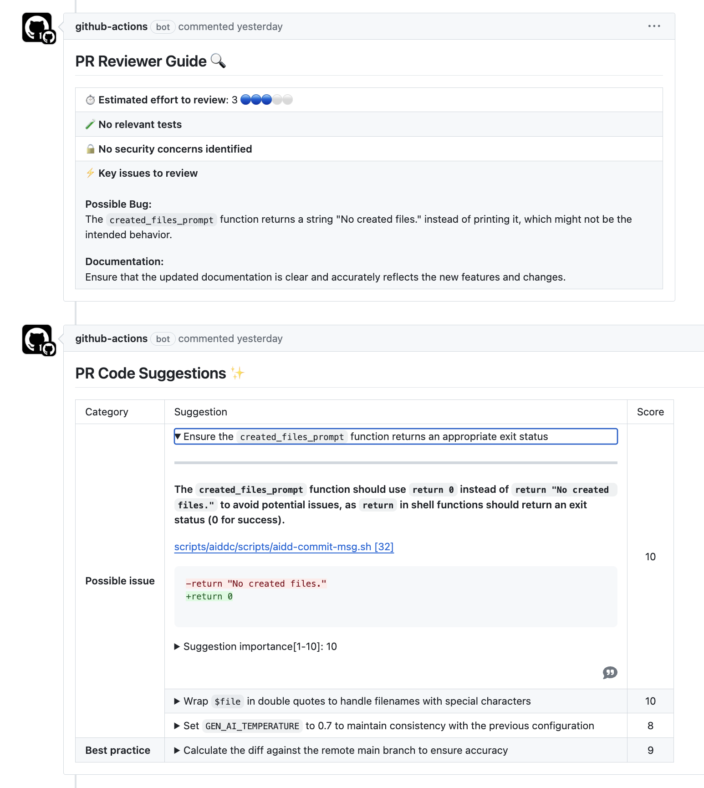
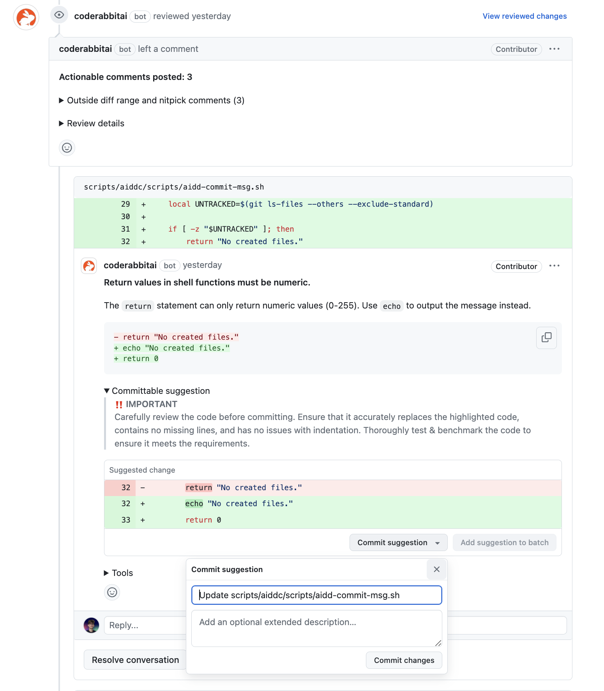

# Code Review using AI

This document tries to help developers regarding code reviews using AI.

**A large amount of tools have been tested, those are the best** (ihmo).

- [Code Review using AI](#code-review-using-ai)
  - [GitHub Action : PR-Agent (by Codium) - Free](#github-action--pr-agent-by-codium---free)
  - [App : CodeRabbit - 15$/mo](#app--coderabbit---15mo)

## GitHub Action : PR-Agent (by Codium) - Free

[PR Agent by Codium](https://github.com/Codium-ai/pr-agent) is the code reviewing tool we are using in this repository.

It is connected to OpenAI and is able to review are code in a cool way.

*Of course you need an OpenAI API key to make it work.*

> [PR-Agent Review Example here](https://github.com/alexsoyes/ai-driven-dev-community/pull/7)

## App : CodeRabbit - 15$/mo

This tool impresses me so much.

[CodeRabbit](https://coderabbit.ai/) has the advantage of always providing a suggestion that you can apply.

> [CodeRabbit Review Example here](https://github.com/alexsoyes/ai-driven-dev-community/pull/7)
