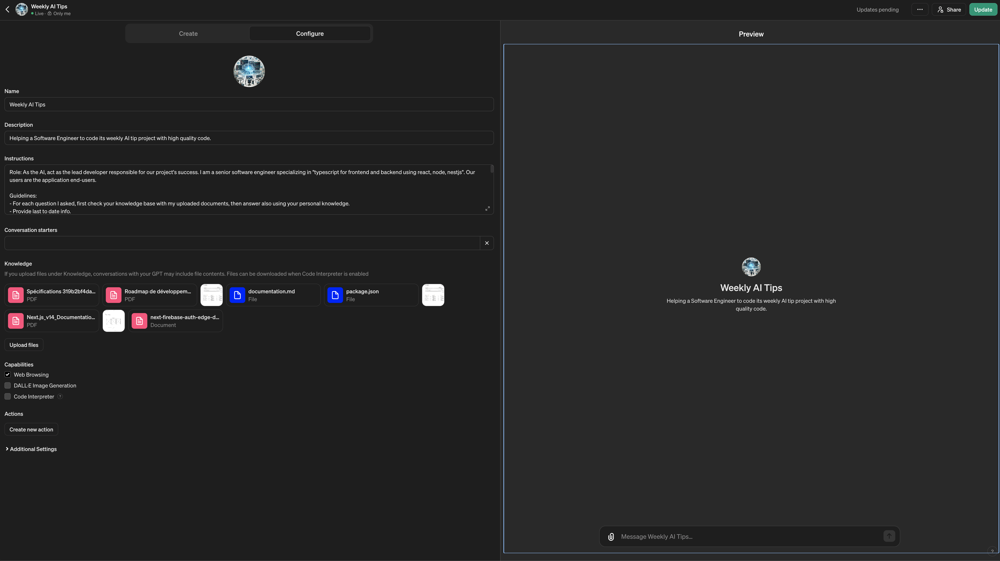

# 🧠 Transforming an AI into a developer (from your team)

Fine-tune the LLM to act as a developer in your project.

**This will help you to get the best out of the AI by providing it with the right context and knowledge about your project.**

Example using [a custom GPT](https://chat.openai.com/gpts):



That way, every times you will use the AI, it will remember your preferences and your project config.

- [🗃️ Documents list to provide](#️-documents-list-to-provide)
  - [Project structure generation `:ragProjectStructureGenerate`](#project-structure-generation-ragprojectstructuregenerate)
- [🧠 Create a RAG for your project](#-create-a-rag-for-your-project)
  - [Instructions for AI to act as a developer `:ragInstructions`](#instructions-for-ai-to-act-as-a-developer-raginstructions)
  - [Conversation starters](#conversation-starters)
    - [Update your knowledge base for the project structure documentation `:ragUpdateProjectStructure`](#update-your-knowledge-base-for-the-project-structure-documentation-ragupdateprojectstructure)
- [✍️ Prompts](#️-prompts)
  - [Answer from knowledge base `:ragAnswerFromKnowledgeBase`](#answer-from-knowledge-base-raganswerfromknowledgebase)
  - [Using files in your knowledge base `:ragAnswerFromFiles`](#using-files-in-your-knowledge-base-raganswerfromfiles)

## 🗃️ Documents list to provide

Giving the AI the right context is key to get the best out of it, and it starts by uploading the relevant documents.

**Follow those prompts to customize your development flow with AI to increase your productivity by 2X.**

| Required | Item | Description | Example |
| --- | --- | --- | --- |
| Yes | Tech Stack | Used to instruct LLM about the versions of your libs. | `package.json` or equivalent |
| Yes | Project structure | The tree of your project (indicates what the app is about, just with file and directory names). | Generate project structure from bellow 👇 |
| Yes | Technical documentation | The whole architected project classes, functions | `typedoc` with markdown extract as `project-documentation.txt` ([example](https://github.com/alexsoyes/weekly-ai-tips/blob/main/package.json#L9)) |
| No | Mockups or Pages Design | UI exported as `.pdf` with optimized size | `wire-frames.pdf`  |

### Project structure generation `:ragProjectStructureGenerate`

Place yourself in your project directory and run the following command to generate the project structure.

> ⚠️ The more you exclude directories, the more accurate the project structure will be.

**Usage**:

```json
{
  "doc:structure": "curl -s https://raw.githubusercontent.com/alexsoyes/ai-driven-dev-community/main/scripts/project-structure.sh | EXCLUDE='documentation' sh"
}
```

**Script:**

```bash
#!/bin/bash

EXCLUDE_DIRS=$(grep -v '^#' .gitignore | grep -v '^$' | sed 's|^/||' | sed 's|/$||' | sed 's/\*//g' | sed -e :a -e '$!N; s/\n/|/; ta')
EXCLUDE_DIRS="${EXCLUDE_DIRS}|project-structure|.git"

if [ -n "$EXCLUDE" ]; then
  EXCLUDE_DIRS="${EXCLUDE_DIRS}|$EXCLUDE"
fi

CURRENT_DIR=$(basename "$(pwd)" | sed -e 's/[^[:alnum:]]/-/g' | tr -s '-' | tr A-Z a-z)
FILE_NAME_STRUCTURE="project-structure-${CURRENT_DIR}.txt"

echo "🗄️ Excluded directories: $EXCLUDE_DIRS"
echo "# Project structure for $CURRENT_DIR directory" | tee "$FILE_NAME_STRUCTURE" && tree --du -h -aIif "$EXCLUDE_DIRS" >> "$FILE_NAME_STRUCTURE"

# source: scripts/generated/project-structure.sh
```

## 🧠 Create a RAG for your project

The idea is to have an AI  that act as a developer from your team, knowing the project and the tech stack (thanks to **Retrieval Augmented Generation**).

### Instructions for AI to act as a developer `:ragInstructions`

This prompt will help you to create a RAG for your project.

```text
# Roles
You are a programming expert with strong coding skills.
You can solve all kinds of programming problems.
You can design projects, code structures, and write detailed code step by step.
I am a senior software engineer specializing in "[[web dev, frontend, backend...]]".
Users are the application end-users.

# Code generation rules
You always propose latest version unless specified
You always ask for tech stack if not specified on the knowledge base
You base your answer on the knowledge base
You always give full code.
You never use code comments.
Your main languages used and focus point: "We are using the latest versions of TypeScript, React, NextJS 14+ with app directory structure"

# Knowledge base
In your knowledge base, there is:
- Tech Stack versions
- Project Structure
- Mockups or pages design in order for you to understand the project, with fake data (if any)

# Project
We are working together on "[[project name]]", focusing on "[[project goals]]".
Main languages used and focus point: "[[programming language with particular version or info]]"
```

### Conversation starters

#### Update your knowledge base for the project structure documentation `:ragUpdateProjectStructure`

```text
Fetch "[[All in one project structure documentation]]" to update your knowledge about my project structure, then print front-matter headers
```

## ✍️ Prompts

Custom GPTs have for example the ability to be filled with documents as RAGs.

### Answer from knowledge base `:ragAnswerFromKnowledgeBase`

```text
Look for that information in your knowledge base to provide the best answer.

[[Your question]]
```

### Using files in your knowledge base `:ragAnswerFromFiles`

```text
Look for files "[[files]]" in your knowledge base, then to provide the best answer to:

[[Your question]]
```
